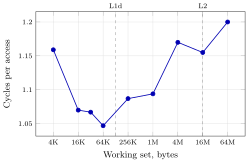
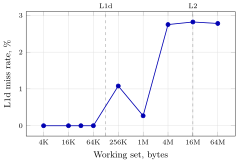
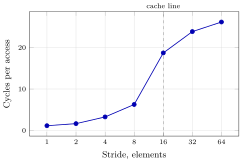
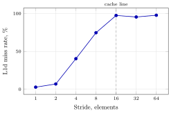

# CPU and memory subsystem

A DAXPY loop, `y[i] = a * x[i] + y[i]`, run on an Apple M3 Pro while the working set, the
stride, the element type and the number of pages it touches are varied, plus a separate test
for the branch predictor. The point is to find every level of the memory hierarchy and every
part of the core in the hardware counters rather than to take them on faith.

## Counting events on macOS

The assignment is written for Linux `perf`, which macOS does not have. Cycles and
instructions come from `/usr/bin/time -l`. Every other event is read with `mperf`, a small
analogue of `perf stat -e`: a library injected into the program through
`DYLD_INSERT_LIBRARIES` that programs the counters through Apple's private `kperf` framework
and prints them for the main thread when the program exits. It needs root.

The M3 event database, `/usr/share/kpep/as3.plist`, holds 67 events: L1 cache, TLB and
branch events, but nothing for L2 or the system level cache. L2 therefore has to be read
indirectly, from the cycles a load spends waiting after an L1d miss.

| | P-cores | E-cores |
|---|---:|---:|
| Cores | 5 | 6 |
| L1d per core | 128 KiB | 64 KiB |
| L2 per cluster | 16 MiB | 4 MiB |

The cache line is 128 B and the page is 16 KiB, against 64 B and 4 KiB on x86, and that moves
every threshold in the assignment: one access per line takes a stride of 16 doubles rather
than 8, and one access per page a stride of 2048 rather than 512.

## Working set

Two arrays of doubles, `W = 2N × 8`, with `N × repeats` held at 2³⁰ so that every point does
the same amount of work.

 

*Cycles per access and the L1d miss rate against the working set.*

Up to 64 KiB there are no L1d misses at all. Past 128 KiB they appear, and past 16 MiB the
cycles a load waits per miss go from 0.2–0.3 to 0.43–0.47, which is L2 running out. Yet the
cost per access rises only from 1.05 to 1.20 cycles: the stream is sequential, the hardware
prefetcher fetches lines ahead of the loads, and the loop is bound by the core, at an IPC of
around 6, rather than by memory.

## Stride

`N = 10⁷`, 20 repeats, stride from 1 to 64. The part of the run that does not depend on the
stride, allocating and filling 160 MB, is measured with zero repeats and subtracted; left in,
it would nearly double the cost per access at stride 64.

 

*Cycles per access and the L1d miss rate against the stride.*

The cost per access nearly doubles with every doubling of the stride up to 8, as each loaded
line serves fewer elements. At 16, one 128-byte line per access, 97% of loads miss L1d and the
cost jumps to 18.7 cycles; beyond that it grows slowly.

## Element type

The same `N`, repeats and stride for `float` and `double`, with `N` chosen so that the `float`
working set fits a cache level and the `double` one does not.

| N | Type | W | Cycles per access | L1d miss rate | Cycles waited per miss |
|---:|---|---:|---:|---:|---:|
| 12 288 | `float` | 96 KiB | 1.024 | 0.01% | 1.10 |
| 12 288 | `double` | 192 KiB | 1.088 | 1.42% | 0.17 |
| 1 572 864 | `float` | 12 MiB | 1.116 | 2.28% | 0.27 |
| 1 572 864 | `double` | 24 MiB | 1.147 | 2.75% | 0.41 |

Halving the element halves the working set, so at the same `N` a `float` array stays one level
closer: in L1d at 12 288 elements and in L2 at 1 572 864, where the `double` one has already
left. When both fit L1d, at `N = 4096`, the cost is the same, since so is the instruction count
per element.

## TLB

A stride of 2048 doubles puts every access on a new 16 KiB page. The number of accesses is
held at 2²⁴ and the setup run is subtracted for each `N`.

| Pages | Cycles per access | L1 dTLB miss rate | L2 TLB misses |
|---:|---:|---:|---:|
| 128 | 21.32 | 0.00% | 16 |
| 256 | 26.50 | 45.47% | 400 |
| 1 024 | 25.64 | 47.72% | 1 769 |
| 2 048 | 46.46 | 54.29% | 24 631 |
| 4 096 | 41.30 | 67.88% | 33 583 663 |
| 32 768 | 31.07 | 93.40% | 33 983 761 |

The L1 dTLB holds between 128 and 256 pages, the L2 TLB between 2048 and 4096. The time does
not follow the TLB alone, though: the peak at 2048 pages comes before the L2 TLB overflows,
and 21 cycles at 128 pages is already an L2 latency, most likely because a 16 KiB stride sends
every access into the same L1d set.

## Branch prediction

`branch_test` adds `data[i]` to a sum when `cond[i]` is set, the condition being either true
for the first half of the array and false for the second, or a pre-generated random sequence.
`N = 10⁶`, 100 repeats; at `-O3` the compiler keeps a real `cbz` for every element.

| Mode | Branches | Mispredicted | Miss rate | Cycles | Time |
|---|---:|---:|---:|---:|---:|
| Predictable | 118 750 413 | 801 | 0.00% | 106 547 396 | 0.030 s |
| Random | 118 762 321 | 47 855 817 | 40.30% | 913 378 231 | 0.223 s |

The random condition takes 8.6 times the cycles; divided by the extra mispredictions, that is
about 17 cycles per miss. With only 1000 elements the predictor learns the whole random
sequence, and the gap shrinks from ninefold to one and a half.

## What it comes to

Locality and branch prediction dominate: a stride of one cache line or an unpredictable
condition costs an order of magnitude, while running out of L1d and L2 on a sequential stream
costs about 15%, because the prefetcher and a wide core hide it. Between runs the instruction
count reproduces within 0.09%, time and cycles within 7–8%, since macOS will not pin a process
to a core.

## Layout

```
cpu/
├── daxpy.cpp          the DAXPY loop; the element type is chosen at build time with -DTYPE
├── branch_test.cpp    a predictable or random conditional branch
├── mperf.c, mperf     the perf stat -e analogue on top of kperf
├── scripts/           one measurement script per stage
└── plots/             plots for this README
```

## Running it

```bash
make all
sudo python3 scripts/stride.py  # any stage script, run from this directory
```
